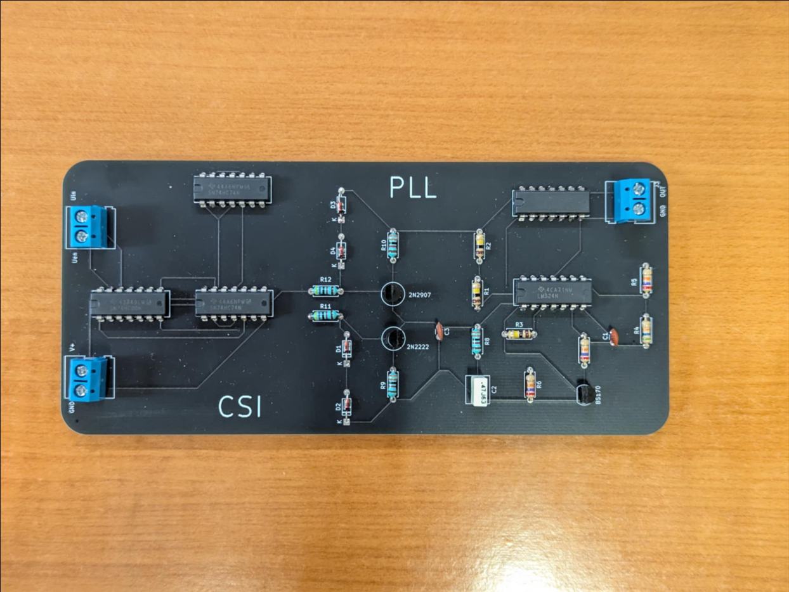

# PLL (Phase-Locked Loop) Project

This project encompasses the design, simulation, and documentation of a Phase-Locked Loop (PLL) circuit. It includes PCB layouts created with KiCad and circuit simulations performed with LTSpice.

## Project Structure

The repository is organized as follows:

*   **`PCB/`**: Contains all KiCad project files related to the Printed Circuit Board (PCB) design of the PLL.
    *   **`PCB/prototype/`**: KiCad project files for a prototype version of the PLL PCB.
    *   **`PCB/testing/`**: KiCad project files used for testing purposes.
    *   **`PCB/simulator_kicad/`**: KiCad projects tailored for circuit simulation, integrating SPICE models.

*   **`simulations/`**: Contains LTSpice simulation files and related documentation.
    *   **`simulations/final.asc`**: An LTSpice simulation schematic.
    *   **`simulations/pll.asc`**: The primary LTSpice simulation schematic for the PLL.
    *   **`simulations/small_signal.asc`**: An LTSpice schematic of the PLL as a system for small-signal behavior analysis.
    *   **`simulations/simulation_log/`**: LaTeX source files for the simulation report.

*   **`report.pdf`**: An overview of the theory behind PLLs and our specific implementation.

## Software & Tools

*   **PCB Design**: KiCad EDA Suite
*   **Circuit Simulation**: LTSpice